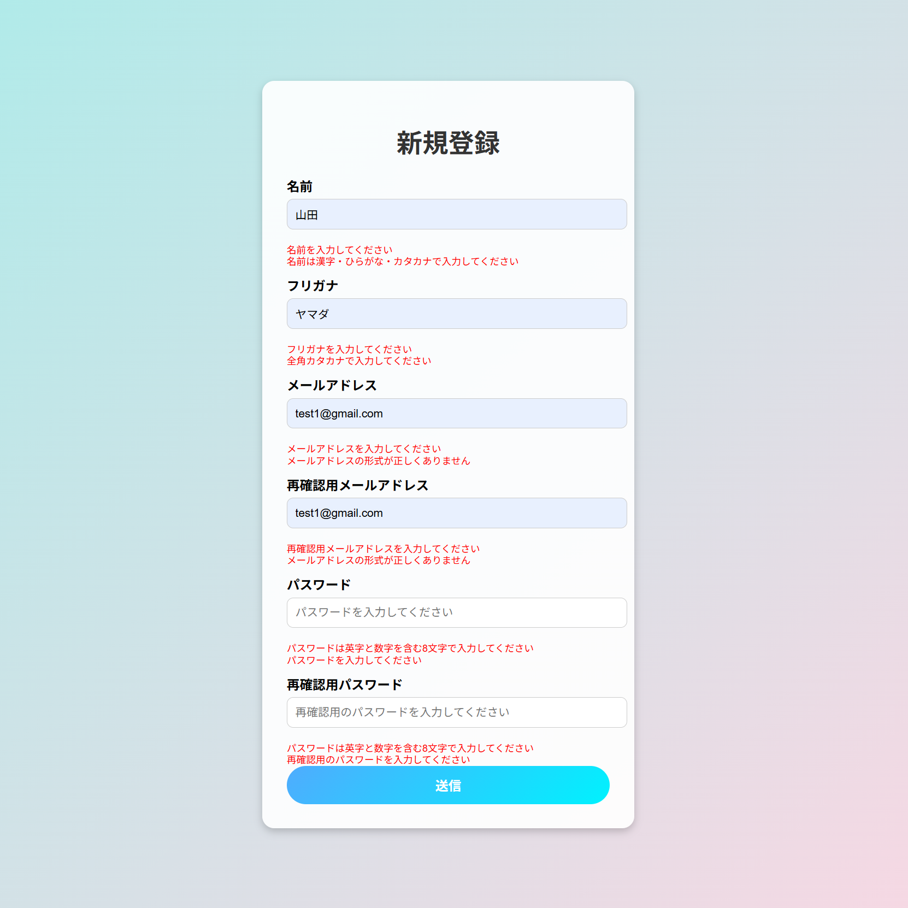
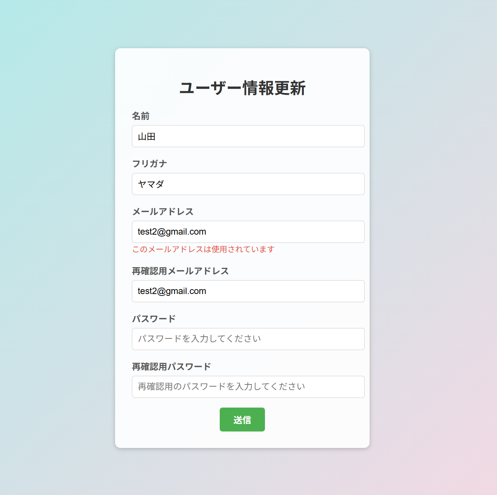

## プロジェクト名

このプロジェクトは Spring Boot を使用した「ユーザー管理システム」です。  
ユーザー登録・ログイン・マイページ一覧・更新・ 削除のCRUD操作ができるようになっています。

---

## バージョン
- Java 17
- Spring Boot 3.3.4

---

## 使用技術（依存関係）
- spring-boot-starter-security
- spring-boot-starter-thymeleaf
- spring-boot-starter-validation
- spring-boot-starter-web
- MyBatis 3.0.5
- Oracle JDBC Driver (ojdbc11)
- Lombok
- Spring Boot DevTools

---

## 機能一覧
- ユーザー登録
- ログイン / ログアウト機能
- マイページ表示
- ユーザー情報更新
- ユーザー削除(論理削除)

---

## 画面説明
### GIF

### 新規登録のエラー画面
#### 各項目を求める値にするためにValidationで制御する

#### メールアドレスとパスワードは二重チェック

### ログインのエラー画面
#### メールアドレスとパスワードの照合でユーザーを識別する

### ユーザー情報更新のエラー画面
#### 各項目を求める値にするためにValidationで制御する

#### メールアドレスの更新時には他のユーザーとメールアドレスが重複していないかチェック
#### またメールアドレスではなくユーザーIDを識別対象として更新する

### 削除したユーザーは完全削除ではなく論理削除となっている
### またDB内では一目みてわかるようにフラグ管理をしており、再登録でも同じメールアドレスが登録できるようになっている
